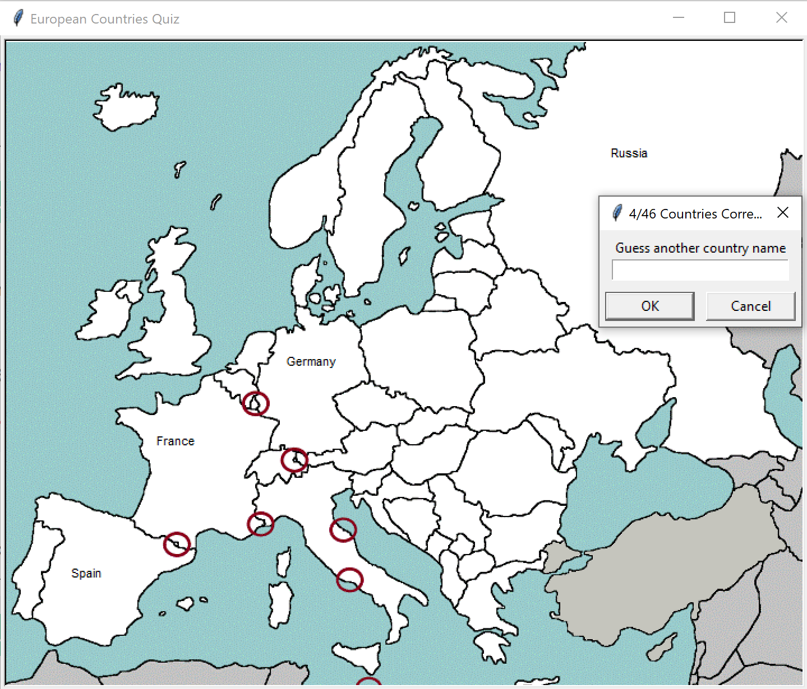

# European_countries_quiz

Using python turtle and pandas to build an european countries list that places names on a map.



Language: Python
Packages used: turtle and pandas

## The Quiz
The user can name all 46 European countries to win the game.

## CSV File
I created a country list and used a bit of code to get the coordinates of the map for each country:

````
def get_mouse_click_coor(x, y):
    print(x, y)
turtle.onscreenclick(get_mouse_click_coor)
turtle.mainloop()
````

The code source is from a Stack Overflow question: https://stackoverflow.com/questions/42878641/get-mouse-click-coordinates-in-python-turtle
The country names were based on https://www.worldometers.info/geography/how-many-countries-in-europe/#:~:text=There%20are%2044%20countries%20in,the%20United%20Nations%20official%20statistics)

The code can be uncommented if coordinates need to be corrected in the future.

## The map
The map used was modified to better suit its use for the game.
Original map source: https://www.pinterest.ch/pin/295267319301252618/
